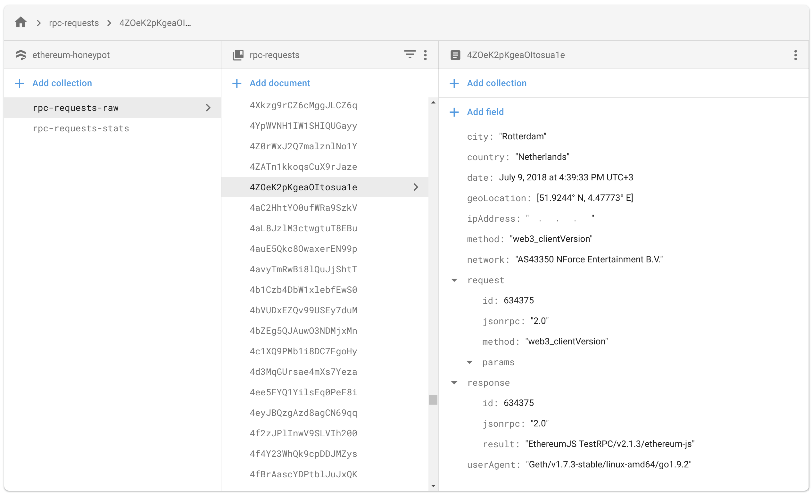
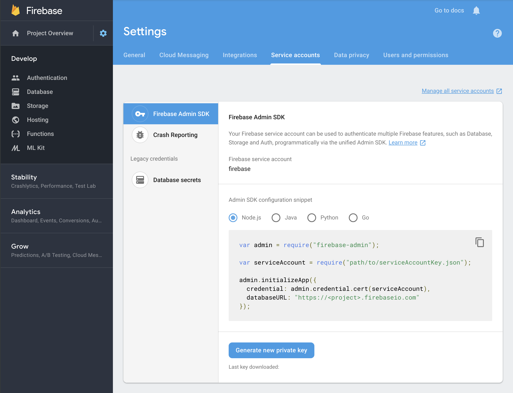

# Ethereum Honeypot

Track external parties actions run on open ethereum nodes.

It uses the `ganache-core` provider to simulate a blockchain, let users make requests against it and log the requests and reposenses, along with various meta-data collected from the originating party.

Currently we track:

- Raw requests:
  - IP Address
  - City
  - Country
  - Latitude
  - Longitude
  - Network (AS)
  - User Agent
  - RPC Method
  - Request Object
  - Response Object
- Stats:
  - Unique Countries count
  - Unique Cities count
  - Unique IP Addresses count
  - Unique RPC Methods count
  - Unique User Agents counts
  - Requests per day
  - Requests per month
  - Requests per year

Currently, it doesn't have a interface to display stats, so you'll have to look at the data directly via the database: _(identifying data redacted)_



### Getting started

To get started, you'll need:

1. A compatible `node` version. Anything above `9.11` will work _(If you use `nvm` to manage your versions, it should pick it up automatically, since this project has an `.nvmrc` file)_

2. Install the packages dependencies _(you can use either `yarn` or `npm`)_:
```bash
yarn
```

3. Build the files. We're using some ES6 features that `node` doesn't currently have, so the packages need to be run through a transpiler first _(it this case `babel`)_:
```bash
yarn build
```

4. Log into the [Firebase Console](https://console.firebase.google.com) and download your project's `serviceAccountKey.json` file _(See [#Database](#database) below)_

5. Start the server. We recommend you start it via that script that also save a log of outputted errors _(you can find that in `server.log`)_:
```bash
yarn start:log
```

#### Optional

6. Setup a `cron` job to periodically (re)start the server

  Certain commands executed against the `ganache-core` provider will crash it. Once that happens it will take the `RPC` server down along with it.

  Until we'll implement our own Ethereum provider _(if we decide to go that route)_ a quick solution for this is to start the server periodically.

  You can do this easily, by creating a new entry in the `crontab` and set it to directly call the `lib/index.js` file _(basically what `yarn start` does)_

  ```bash
  echo "* */1 * * * user /path/to/node /path/to/ethereum-honeypot/lib/index.js 2>&1" >> /etc/cron.d/ethereum-honeypot
  ```
  _**Note:** You need absolute path to both the `node` binary and the the `index.js` file inside the repository_

  _**Tip:** You can find the location of your `node` binary by running:_
  ```bash
  which node
  ```

### Database

For data storage this project currently uses Firebase's [Cloud Firestore](https://firebase.google.com/docs/firestore/) NoSQL engine.

To be able to set up the project, you'll need a _(free)_ account and to create a project.

1. Log into the _[Firebase Console](https://console.firebase.google.com)_ and click on _**"Add project"**_

2. On the left sidebar, select _**"Database"**_ and create a new one.

3. On the left sidebar, click on the _**"Settings"**_ icon _(cog wheel)_, and select _**"Users and permissions"**_.

4. Select the _**"Service accounts"**_ tab

5. Under the _**"Firebase Admin SDK"**_ section, select the _**"Node.js"**_ engine and click _**"Generate new private key"**_ button.

6. Save the `.json` file in the repository's root folder as `serviceAccountKey.json`

7. At this point, you'll be able to start the server without any problems.



### Migrations

#### `Sqlite3` to `Firestore` migration

The initial version of this app used the `sqlite3` file engine to store requests data.

If you ran the app during that period and want to move that data to the current `Firestore` engine, there's the migration script: `yarn migrate:sqlite3`.

It takes in two environment variables trough which you can set the source `database` file location, and the destination `collection` name:
- `COLLECTION`, used to set the destination `firestore` collection name, defaults to `rpc-requests-raw`.
- `DB_PATH`, used to set the source `sqlite3` file location. If it's not set, the script will not start.

_Example:_
```bash
DB_PATH='../database/old_database.sql' COLLECTION='rpc-requests-test' yarn migrate:sqlite3
```

**WARNING: Don't run this more than one time on a single collection as your data will be doubled and it will VERY hard to clean that up afterwards.**

_NOTE: Depending on the size of your database, this could take quite a toll on your [daily quota](https://firebase.google.com/docs/firestore/pricing?authuser=0). Remember, you only have `50000` writes on the free plan._

### License

This project is licensed under [MIT](./LICENSE).

```
MIT License

Copyright (c) 2018 Raul Glogovetan

Permission is hereby granted, free of charge, to any person obtaining a copy
of this software and associated documentation files (the "Software"), to deal
in the Software without restriction, including without limitation the rights
to use, copy, modify, merge, publish, distribute, sublicense, and/or sell
copies of the Software, and to permit persons to whom the Software is
furnished to do so, subject to the following conditions:

The above copyright notice and this permission notice shall be included in all
copies or substantial portions of the Software.

THE SOFTWARE IS PROVIDED "AS IS", WITHOUT WARRANTY OF ANY KIND, EXPRESS OR
IMPLIED, INCLUDING BUT NOT LIMITED TO THE WARRANTIES OF MERCHANTABILITY,
FITNESS FOR A PARTICULAR PURPOSE AND NONINFRINGEMENT. IN NO EVENT SHALL THE
AUTHORS OR COPYRIGHT HOLDERS BE LIABLE FOR ANY CLAIM, DAMAGES OR OTHER
LIABILITY, WHETHER IN AN ACTION OF CONTRACT, TORT OR OTHERWISE, ARISING FROM,
OUT OF OR IN CONNECTION WITH THE SOFTWARE OR THE USE OR OTHER DEALINGS IN THE
SOFTWARE.
```
