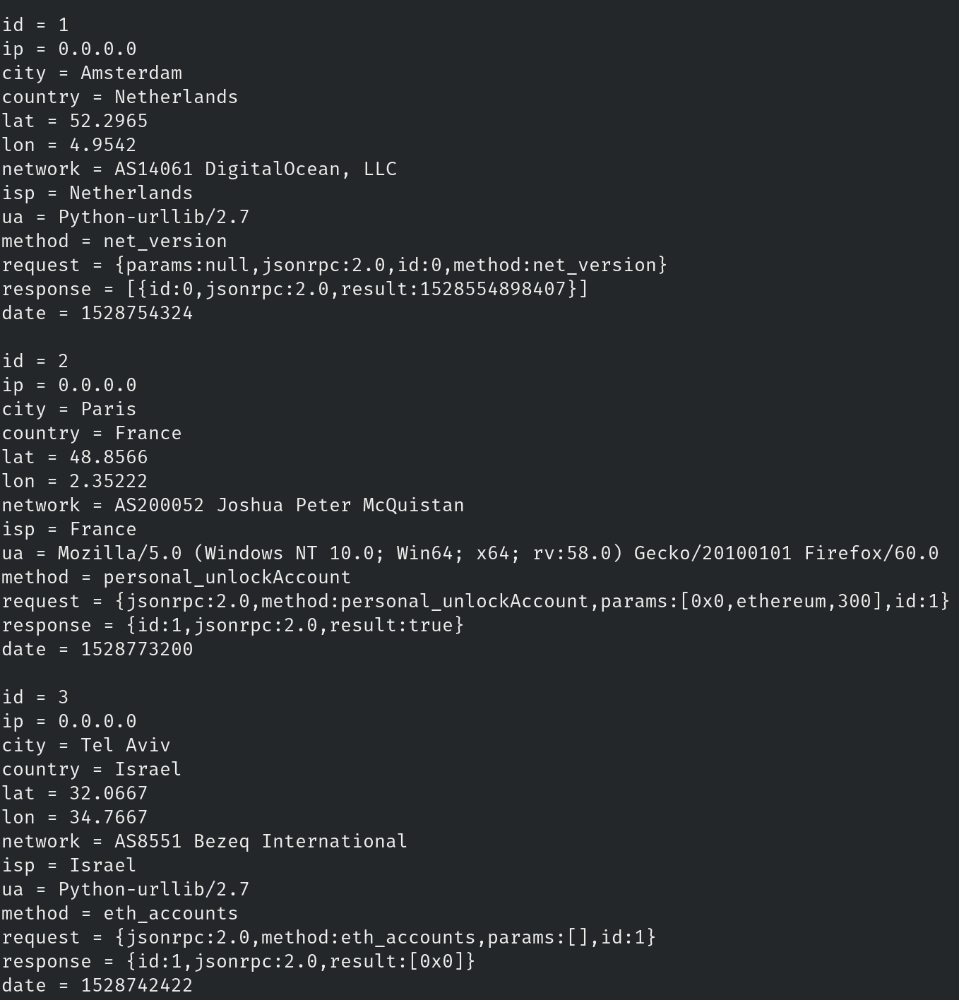

# Ethereum Honeypot

Track external parties actions run on open ethereum nodes.

It uses the `ganache` provider to simulate a blockchain, let users make requests against it and log the requests and reposenses, along with various meta-data collected from the originating party.

Currently we track:
- IP Address
- City
- Country
- Latitude
- Longitude
- Network (AS)
- ISP
- User Agent
- PRC Method _(useful for stats)_
- Request Object
- Response Object

Currently, it doesn't have a interface to display stats, so you'll have to look at the data directly via the database: _(identifying data redacted)_



### Getting started

To get started, you'll need:

1. A compatible `node` version. Anything above `9.11` will work _(If you use `nvm` to manage your versions, it should pick it up automatically, since this project has an `.nvmrc` file)_

2. Install the packages dependencies _(you can use either `yarn` or `npm`)_:
```bash
yarn
```

3. Build the files. We're using some ES6 features that `node` doesn't currently have, so the packages need to be run through a transpiler first _(it this case `babel`)_:
```bash
yarn build
```

4. Start the server. We recommend you start it via that script that also save a log of outputted errors _(you can find that in `server.log`)_:
```bash
yarn start:log
```

### Database

Currently this project uses `sqlite` as a file database, but it's in the roadmap to change it.

### License

This project is licensed under [MIT](./LICENSE).
