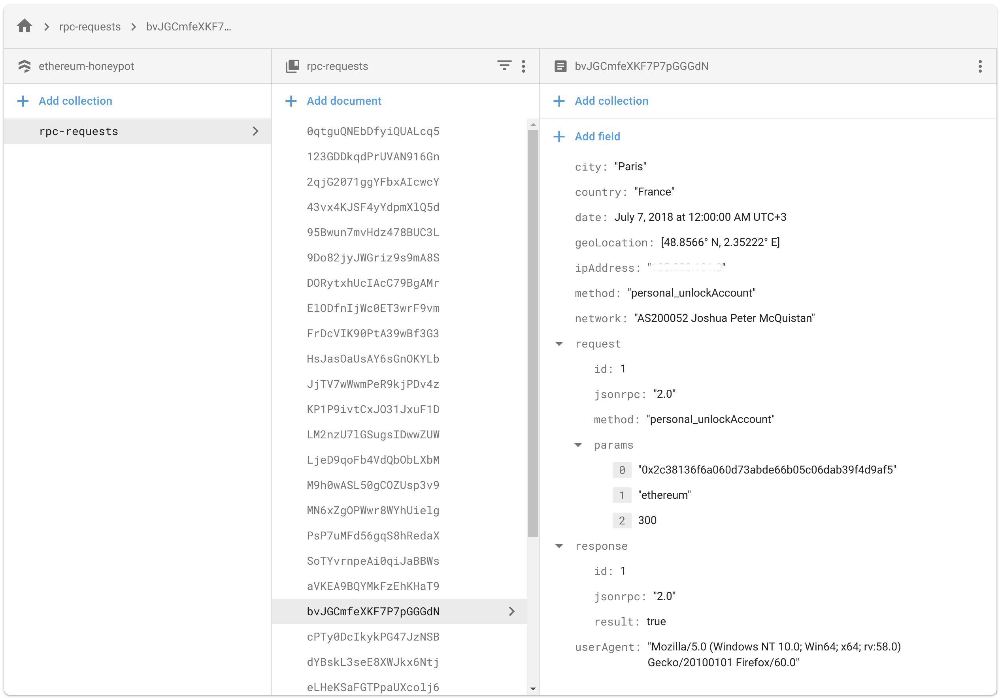

# Ethereum Honeypot

Track external parties actions run on open ethereum nodes.

It uses the `ganache-core` provider to simulate a blockchain, let users make requests against it and log the requests and reposenses, along with various meta-data collected from the originating party.

Currently we track:
- IP Address
- City
- Country
- Latitude
- Longitude
- Network (AS)
- User Agent
- PRC Method _(useful for stats)_
- Request Object
- Response Object

Currently, it doesn't have a interface to display stats, so you'll have to look at the data directly via the database: _(identifying data redacted)_



### Getting started

To get started, you'll need:

1. A compatible `node` version. Anything above `9.11` will work _(If you use `nvm` to manage your versions, it should pick it up automatically, since this project has an `.nvmrc` file)_

2. Install the packages dependencies _(you can use either `yarn` or `npm`)_:
```bash
yarn
```

3. Build the files. We're using some ES6 features that `node` doesn't currently have, so the packages need to be run through a transpiler first _(it this case `babel`)_:
```bash
yarn build
```

4. Log into the [Firebase Console](https://console.firebase.google.com) and download your project's `serviceAccountKey.json` file _(See [#Database](#database) below)_

5. Start the server. We recommend you start it via that script that also save a log of outputted errors _(you can find that in `server.log`)_:
```bash
yarn start:log
```

### Database

For data storage this project currently uses Firebase's [Cloud Firestore](https://firebase.google.com/docs/firestore/) NoSQL engine.

To be able to set up the project, you'll need a _(free)_ account and to create a project.

1. Log into the _[Firebase Console](https://console.firebase.google.com)_ and click on _**"Add project"**_

2. On the left sidebar, select _**"Database"**_ and create a new one.

3. On the left sidebar, click on the _**"Settings"**_ icon _(cog wheel)_, and select _**"Users and permissions"**_.

4. Select the _**"Service accounts"**_ tab

5. Under the _**"Firebase Admin SDK"**_ section, select the _**"Node.js"**_ engine and click _**"Generate new private key"**_ button.

6. Save the `.json` file in the repository's root folder as `serviceAccountKey.json`

7. At this point, you'll be able to start the server without any problems.


### License

This project is licensed under [MIT](./LICENSE).
